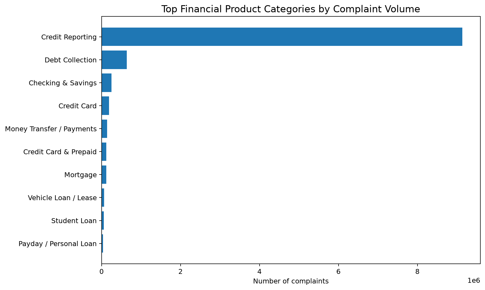
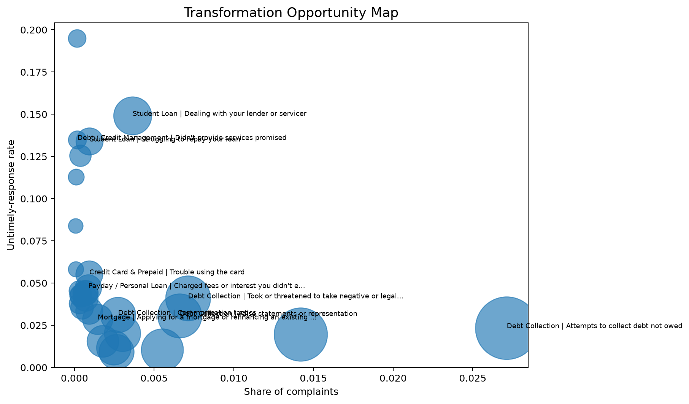

# Banking Operations & Transformation Intelligence

### Turning financial services complaint data into operational insights and transformation priorities

## Overview

In this project, I analyse the CFPB Consumer Complaint Database to identify recurring customer pain points, operational signals and potential transformation priorities in financial services.

My objective is not simply to count complaints. I want to understand where operational issues appear to be concentrated, how they differ across financial products and issues, and where further investigation or transformation could create the greatest value.

I approached the project from a Financial Services Consulting perspective, combining data analysis, operational thinking and structured prioritisation.

---

## Business Questions

I structured my analysis around five questions:

1. Where is customer pain concentrated?
2. Which financial products and issues generate the strongest operational signals?
3. Where do I observe potential service-performance issues?
4. How have complaint patterns evolved over time?
5. Which areas should be prioritised for further transformation analysis?

---

## Dataset

I used the **Consumer Complaint Database** published by the U.S. Consumer Financial Protection Bureau (CFPB).

The analysis covers complaints received between **January 2021 and December 2025**.

The original dataset contains more than 10 million records for this period. I process the data in chunks to keep the analysis reproducible and memory-efficient.

### Source

Consumer Financial Protection Bureau:

https://www.consumerfinance.gov/data-research/consumer-complaints/

The CFPB explains that complaint data should be interpreted carefully and should not be considered a statistically representative sample of all consumers.

---

## Visual Insights

### Complaint Trends


### Top Financial Products



### Transformation Priority Matrix



---


## Analytical Approach

I structured the analysis as follows:

```text
Raw Complaint Data
        ↓
Data Quality Assessment
        ↓
Data Preparation
        ↓
Product & Issue Analysis
        ↓
Operational KPI Analysis
        ↓
Trend Analysis
        ↓
Transformation Priority Scoring
        ↓
Priority Matrix
        ↓
Business Recommendations